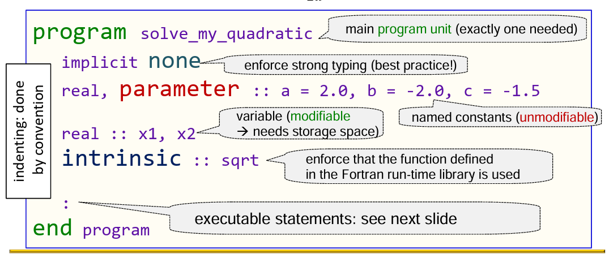
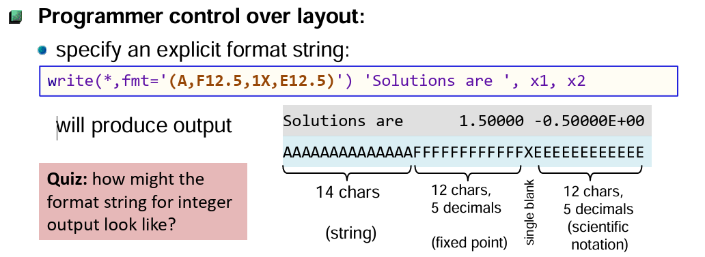

# Lesson 1.1: Hello World

## Overview
This lecture introduces the basics of **Fortran programming** using the classic "Hello World" example. You will learn:

- Structure of a Fortran program
- Basic output using `PRINT` and `WRITE`

## 1. Structure of a Fortran Program

A simple Fortran program has the following structure:



```fortran
PROGRAM program_name
! declarations (optional)
   ! executable statements
END PROGRAM program_name
```

1. Structure
   - `PROGRAM` starts the program
   - `END PROGRAM` ends it
   - In Fortran, every program must begin with a program statement (or a module/subroutine if defining reusable components)
2. Declarations
   - Fortran variables must be declared before executable statements
3. Executable statements
   - Statements inside define the program behavior and change values of variables

- Comments start with `!`
- Fortran is not case-sensitive

## 2. Writing on stdout

### PRINT

```fortran
PRINT *, expression_list
```

- the `PRINT` statement is used to display output to the standard output (STDOUT), typically the console or terminal
- `*` This is called the **format specifier**. Using `*` means list-directed formatting, which automatically chooses a reasonable way to display the values. You can also use a format label instead of `*` for custom formatting
- `expression_list` – A comma-separated list of variables, constants, or expressions you want to print

```fortran
PROGRAM main
   ! Integer constant
   PRINT *, 42
   
   ! Real (floating-point) constant
   PRINT *, 3.14159
   ! Real, width 10, 2 decimal places
   PRINT '(F10.2)', 3.14159
   
   ! Double precision constant
   PRINT *, 2.718281828D0
   ! Double precision in scientific notation
   PRINT '(E12.5E2)', 2.718281828D0           

   ! Logical constant
   PRINT *, .TRUE.
   PRINT *, .FALSE.
   ! Character string constant
   PRINT *, 'Hello, Fortran!'
   ! Character, width 20
   PRINT '(A20)', 'Hello, Fortran!'               

   ! Multiple constants together
   PRINT *, 'Value of Pi:', 3.14159, 'Integer:', 7, 'Logical:', .TRUE.
   
END PROGRAM main
```

### WRITE

```fortran
WRITE (*,*), expression_list
```

- The `WRITE(*,*)` statement is used to display output, typically to the console (STDOUT).
- The first `*` is the **unit number**; `*` means standard output.
- The second `*` is the **format specifier**; using `*` means list-directed formatting, which automatically chooses a reasonable way to display the values. You can also use a format label or explicit format instead of `*`.
- `expression_list` – A comma-separated list of variables, constants, or expressions you want to print


