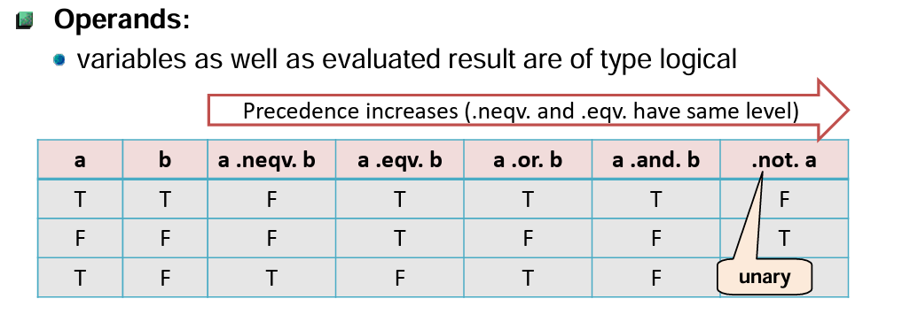

# Lesson 1.3: Operations

## Overview

This lesson demonstrates how to perform arithmetic, relational, and logical operations in Fortran.

- Arithmetic operations
- Relational operations
- Logical operations
- Data type conversions
- Combining operations in expressions

## 1. Arithmetic operations

Arithmetic operations allow you to perform calculations with numeric variables:

| Operation      | Fortran Syntax | Example       |
| -------------- | -------------- |---------------|
| Addition       | `a + b`        | `3 + 2 = 5`   |
| Subtraction    | `a - b`        | `5 - 2 = 3`   |
| Multiplication | `a * b`        | `4 * 3 = 12`  |
| Division       | `a / b`        | `7 / 2 = 3`   |
| Exponentiation | `a ** b`       | `2 ** 3 = 8`  |

```fortran
PROGRAM arithmetic_fortran
INTEGER :: a, b, sum, diff, prod, div
REAL :: x, y, result

    a = 7
    b = 2
    sum = a + b
    diff = a - b
    prod = a * b
    div = a / b

    x = 3.0
    y = 2.0
    result = x ** y

    PRINT *, 'Sum:', sum
    PRINT *, 'Difference:', diff
    PRINT *, 'Product:', prod
    PRINT *, 'Integer Division:', div
    PRINT *, 'Exponentiation:', result
END PROGRAM arithmetic_fortran
```

## 2. Relational operations

Relational operations compare values and return boolean results:

| Operation        | Fortran Syntax |
| ---------------- | -------------- | 
| Equal            | `a == b`       |
| Not equal        | `a /= b`       |
| Less than        | `a < b`        |
| Greater than     | `a > b`        |
| Less or equal    | `a <= b`       |
| Greater or equal | `a >= b`       |

```fortran
PROGRAM relational_fortran
INTEGER :: a, b
LOGICAL :: result

    a = 5
    b = 3

    result = (a == b)
    PRINT *, 'a == b:', result
    result = (a /= b)
    PRINT *, 'a /= b:', result
    result = (a > b)
    PRINT *, 'a > b:', result
END PROGRAM relational_fortran
```

## 3. Logical operations
Logical operations are applied to boolean values:

| Operation | Fortran Syntax | Examples              |
| --------- | -------------- |-----------------------|
| AND       | `.AND.`        | `a .AND. .TRUE.`      |
| OR        | `.OR.`         | `.FALSE. .OR. .TRUE.` |
| NOT       | `.NOT.`        | `.NOT. b`             |



```fortran
PROGRAM logical_fortran
LOGICAL :: a, b, result

    a = .TRUE.
    b = .FALSE.

    result = a .AND. b
    PRINT *, 'a AND b:', result
    result = a .OR. b
    PRINT *, 'a OR b:', result
    result = .NOT. a
    PRINT *, 'NOT a:', result
END PROGRAM logical_fortran
```

## 4. Data type conversions
Data type conversion allows you to change a variable from one type to another. This is important for arithmetic operations, avoiding integer division issues, or interacting with functions requiring specific types.

Fortran provides **intrinsic** functions for type conversion:

| Conversion                 | Function                    | Example                    |
| -------------------------- | --------------------------- | -------------------------- |
| Integer → Real             | `REAL(x)`                   | `REAL(5) = 5.0`            |
| Real → Integer             | `INT(x)`                    | `INT(3.7) = 3` (truncates) |
| Integer → Double Precision | `DBLE(x)`                   | `DBLE(5) = 5.0D0`          |
| Real → Complex             | `CMPLX(x)`                  | `CMPLX(3.0) = (3.0,0.0)`   |
| Character → Number         | `ICHAR(c)` (character code) | `ICHAR('A') = 65`          |
| Number → Character         | `CHAR(n)`                   | `CHAR(65) = 'A'`           |

```fortran
PROGRAM type_conversion_fortran
INTEGER :: i
REAL :: r
DOUBLE PRECISION :: d
COMPLEX :: c

    i = 7
    r = REAL(i)         ! Convert integer to real
    d = DBLE(r)         ! Convert real to double precision
    c = CMPLX(r)        ! Convert real to complex

    PRINT *, 'Integer i:', i
    PRINT *, 'Converted to Real:', r
    PRINT *, 'Converted to Double Precision:', d
    PRINT *, 'Converted to Complex:', c
END PROGRAM type_conversion_fortran
```

## 5. Combining operations in expressions

You can combine arithmetic, relational, and logical operations in expressions:
```fortran
PROGRAM combined_fortran
INTEGER :: x, y
LOGICAL :: check

    x = 10
    y = 5

    check = ((x + y) > 12) .AND. (y /= 0) .AND. ((REAL(x) / REAL(y)) >= 4.3) ! Avoid integer division
    PRINT *, 'Combined operation result:', check
END PROGRAM combined_fortran
```
