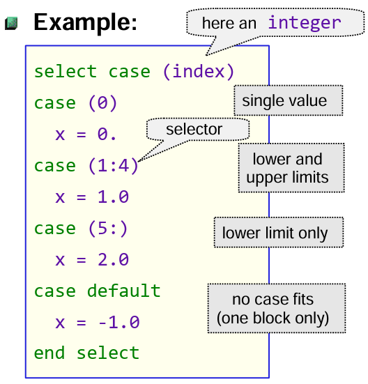

# Lesson 1.4: Conditionals and Loops

## Overview

This lesson introduces control flow in Fortran using conditional statements and loops.

- Conditional statements (`IF`, `SELECT CASE`)
- Loops (`DO`, `DO WHILE`)
- Loop control statements (`EXIT`, `CYCLE`)

## 1. Conditional statements

Conditional statements allow your program to make decisions based on logical expressions.

### a, Simple `IF` statement

Executes a block of code only if a condition is true:

```fortran
PROGRAM simple_if
INTEGER :: x

    x = 5
    IF (x > 0) THEN
        PRINT *, 'x is positive'
    END IF
END PROGRAM simple_if
```

### b, `IF-ELSE` statement

Provides an alternative block if the condition is false:

```fortran
PROGRAM if_else
INTEGER :: x

    x = -3
    IF (x > 0) THEN
        PRINT *, 'x is positive'
    ELSE
        PRINT *, 'x is zero or negative'
    END IF
END PROGRAM if_else
```

### c, `IF-ELSE IF-ELSE` statement

Handles multiple conditions:

```fortran
PROGRAM if_elseif_else
INTEGER :: x

    x = 0
    IF (x > 0) THEN
        PRINT *, 'x is positive'
    ELSE IF (x < 0) THEN
        PRINT *, 'x is negative'
    ELSE
        PRINT *, 'x is zero'
    END IF
END PROGRAM if_elseif_else
```

### d, `SELECT CASE` statement

Simplifies multiple condition checks for a single variable (Pattern matching):

```fortran
PROGRAM select_case_example
INTEGER :: day

    day = 3
    SELECT CASE (day)
    CASE (1)
        PRINT *, 'Monday'
    CASE (2)
        PRINT *, 'Tuesday'
    CASE (3)
        PRINT *, 'Wednesday'
    CASE DEFAULT
        PRINT *, 'Other day'
    END SELECT
END PROGRAM select_case_example
```



## 2. Loops

Loops allow repeated execution of code blocks.

### a, `DO` loop

Executes a block a fixed number of times:

```fortran
PROGRAM do_loop_example
INTEGER :: i

    DO i = 1, 5
        PRINT *, 'Iteration:', i
    END DO
END PROGRAM do_loop_example
```

### b, `DO WHILE` loop

Executes as long as a condition is true:

```fortran
PROGRAM do_while_example
INTEGER :: x

    x = 1
    DO WHILE (x <= 5)
        PRINT *, 'x =', x
        x = x + 1
    END DO
END PROGRAM do_while_example
```

### c, Nested loop

You can place loops inside loops:

```fortran
PROGRAM nested_loops
INTEGER :: i, j

    DO i = 1, 3
        DO j = 1, 2
            PRINT *, 'i =', i, ', j =', j
        END DO
    END DO
END PROGRAM nested_loops
```

## 3. Loop control statements

### a, `EXIT`

Terminates the nearest enclosing loop:

```fortran
PROGRAM exit_example
INTEGER :: i

    DO i = 1, 10
        IF (i == 5) EXIT
        PRINT *, i
    END DO
END PROGRAM exit_example
```

### b, `CYCLE`

Skips the current iteration and continues with the next:

```fortran
PROGRAM cycle_example
INTEGER :: i

    DO i = 1, 5
        IF (MOD(i,2) == 0) CYCLE   ! Skip even numbers
        PRINT *, i
    END DO
END PROGRAM cycle_example
```

